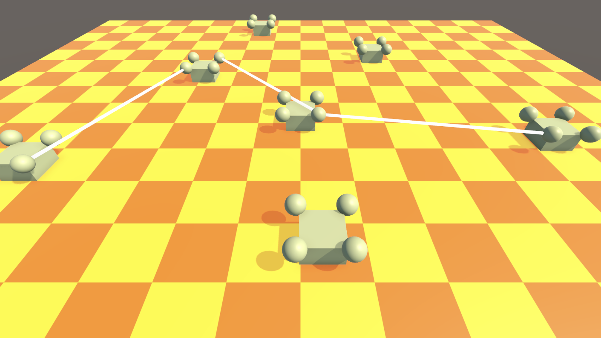

<h1>Crazy Pawns</h1>

<h2>Описание:</h2>
Требуется создать демо приложение представляющее из себя "шахматную доску" с расположенными на ней фигурами. Фигуры можно соединять между собой через шароконнекторы, а так же свободно передвигать по "доске" и удалять с неё. У камеры есть возможность перемещаться пользователем в пространстве. (2022.3.15f1)

<h2>Критерии приёмки</h2>
<li>Функционал связанный с фигурами, их созданием, перемещением, соединением должен быть реализован и присутствовать в проекте;</li>
<li>Функционал связанный с генерацией "шахматной доски", её наличие в приложении - может быть не реализован и отсутствовать в проекте (информацию можно использовать для понимания наличия сопряжённых систем);</li>
<li>Функционал связанный с перемещением камеры пользователем - может быть не реализован и отсутствовать в проекте (информацию можно использовать для понимания наличия сопряжённых систем).</li>

<h2>Ресурсы:</h2>
<li>Настроечные параметры находятся в ассете Templates/CrazyPawnSettings (Scriptable Object);</li>
<li>Текущая рабочая сцена - Scenes/PawnField;</li>
<li>Префаб фигуры для доски - Templates/Pawn.</li>

<h2>Поведение, взаимодействие, описание компонентов</h2>

<h4>Доска</h4>
Представляет из себя квадрат (плоскую фигуру) сориентированный сторонами вдоль осей X и Z и центром в (0, 0, 0). 
Содержит на себе "шахматную раскраску". 
Размер клетки 1,5 * 1,5 юнита. 
Цвета клеток задаются в CrazyPawnSettings ассете.
Размер доски в количестве клеток на сторону задаётся в CrazyPawnSettings ассете.
Последовательность цветов клеток (сначала "белые" потом "чёрные" или наоборот) не важна.

<h4>Фигуры</h4>

Каждая фигура представляет из себя тело параллелепипед с 4 шарами-коннекторами по углам верхней грани тела (префаб Templates/Pawn). Все фигуры располагаются на поверхности плоскости Y = 0.

При запуске игры спавнятся в области создания (круге, сориентированным в плоскости Y = 0, с центром в (0, 0, 0) и радиусом, указанным в настройках), распределяясь рандомно по всей области. Количество создаваемых фигур при запуске игры указано в настройках. Пересечение фигур допускается, проверками на коллизии можно пренебречь.
 

<h6>Перемещение и удаление</h6>

Пользователь может перемещать фигуры в плоскости Y = 0, драгая их за тело. Пересечение фигур (как в процессе перемещения так и в оставленном состоянии) допускается, проверками на коллизии можно пренебречь. Если в процессе перемещения фигура центром окажется за пределами доски, она целиком (тело и шароконнекторы) перекрашивается в красный (ссылка на материал находится в настройках), при возвращении фигуры обратно на доску перекраска снимается. Если пользователь отпустит фигуру за пределами доски - фигура удалится.

<h6>Соединение фигур</h6>

Пользователь может соединять фигуры между собой (визуальный эффект, не ограничивает перемещение и удаление фигур).

Соединение представляет из себя однородный (сплошная закраска без градиента, unlit) белый (1, 1, 1) не прозрачный отрезок линии шириной 0,07 юнита, соединяющий шароконнектор одной фигуры (центр сферы) с шароконнектором другой фигуры. Шароконнектор одной фигуры может быть соединён с одним или несколькими шароконнекторами другой/других фигур. Соединять между собой шароконнекторы одной и той же фигуры не допускается. При перемещении фигур линии соединений продолжают соединять шароконнекторы подстраиваясь под новые позиции объектов.

Пользователь имеет возможность создавать соединения двумя способами:
<li>последовательными кликами в шароконнекторы двух фигур;</li>
<li>драгом с шароконнектора одной фигуры на шароконнектор другой фигуры.</li>

При первом клике в шароконнектор или при начале драга за шароконнектор все доступные для соединения шароконнекторы перекрашиваются в активный цвет (материал перекраски указан в настройках). При повторном клике (вне зависимости куда кликнули) или при окончании драга (вне зависимости над каким объектом драг прекращён) процесс создания связи оканчивается, подкраска шароконнекторов прекращается. Если второй клик был в доступный шароконнектор или драг был завершён на доступном шароконнекторе - создаётся связь.

<h4>Камера</h4>

Перспективная камера с настроенным FoV, положением и ориентацией уже расположена в активной сцене Scenes/PawnField.

Пользователь имеет возможность перемещать камеру в пространстве:
<li>при помощи драга - в плоскости Y = 0;</li>
<li>при помощи скрола колёсиком - в направлении "на курсор" (наезд и отъезд по направлению: позиция камеры - "точка в мире" под курсором).</li>

При необходимости наличия настроек камеры - их нужно разместить на компоненте на камере.

<h3>Приложение</h3>
Параметры Настроек (CrazyPawnSettings):</li>
<li>InitialZoneRadius - радиус области создания в юнитах;</li>
<li>InitialPawnCount - количество спавнящихся при запуске игры фигур;</li>
<li>DeleteMaterial - материал для покраски удаляемых фигур;</li>
<li>ActiveConnectorMaterial - материал для покраски доступных для подсоединения коннекторов;</li>
<li>CheckerboardSize - размер шахматной доски (количество клеток по стороне);</li>
<li>BlackCellColor - первый из двух цветов шахматной доски;</li>
<li>WhiteCellColor - второй из двух цветов шахматной доски.</li>

